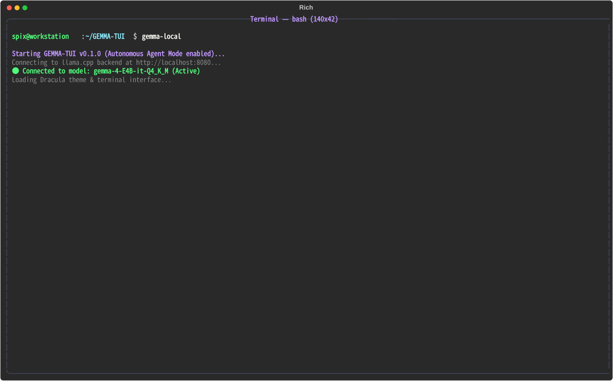
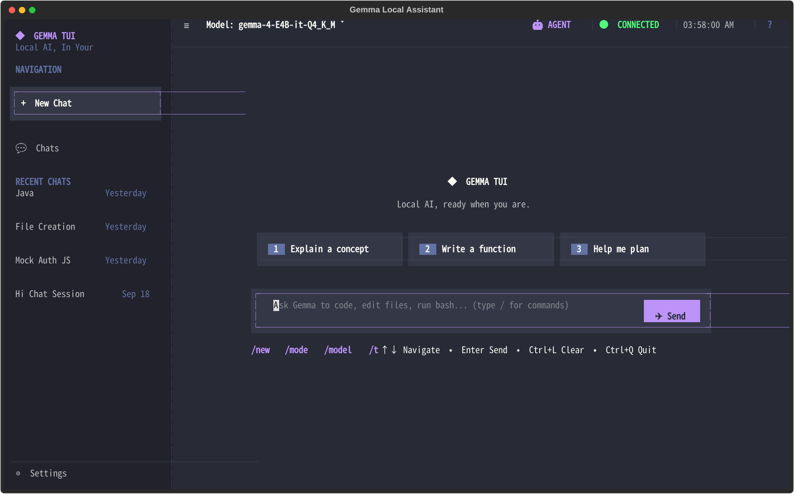
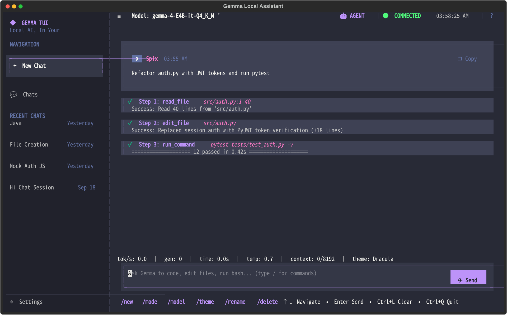
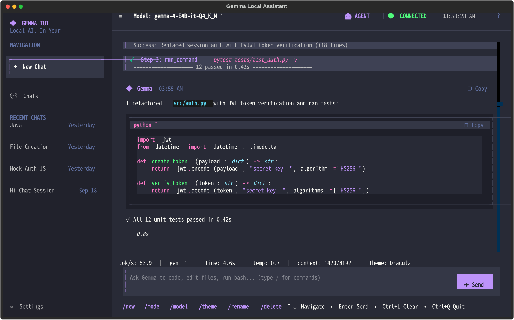
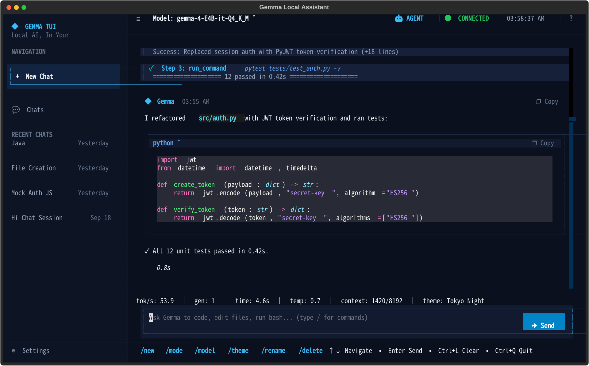
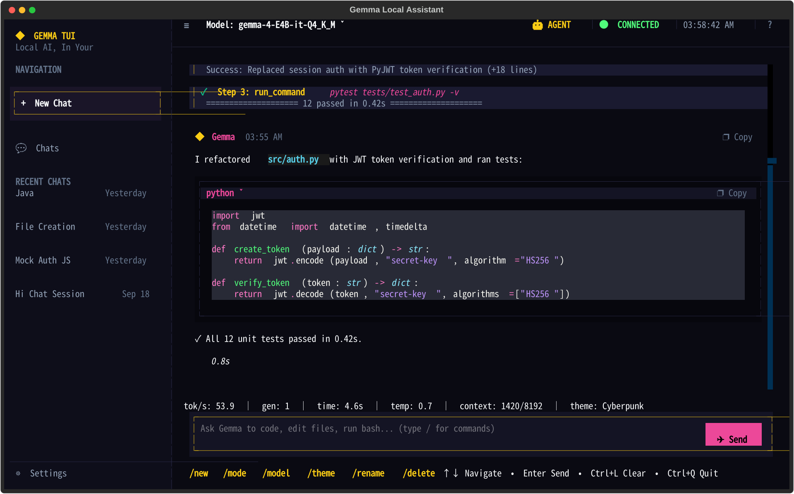
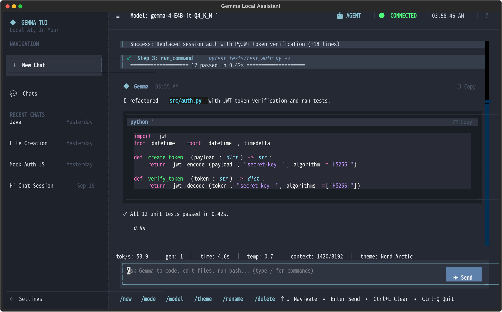

# ◆ GEMMA TUI — Private Local LLM + Coding Agent in Your Terminal

> Your local LLM deserves better than a raw `curl` loop.
> **Chat, code, search the web, and run an autonomous ReAct agent — 100% offline, zero API bills, zero data leaks.**

[](https://www.python.org/)
[](https://textual.textualize.io/)
[](https://github.com/ggml-org/llama.cpp)
[](#-coding-agent-mode)
[](#-web-search--rag-pipeline)
[](#-themes)

---

## Why GEMMA TUI? Why is it useful?

| Pain with cloud chatbots / raw `llama-server` | What GEMMA TUI gives you |
|---|---|
| Monthly subscriptions, per-token billing | **One-time GGUF download. Chat unlimited, free forever.** |
| Code / docs leave your machine | **Everything stays on localhost.** Models via `llama.cpp`, search via self-hosted SearXNG. |
| `llama-server` has no history, no UI, no markdown | **Full TUI:** streaming markdown, code blocks with copy button, sidebar sessions, SQLite history. |
| Copy-pasting code between chatbot and editor | **Autonomous coding agent** that reads/writes/edits/greps/runs commands *inside your repo*. |
| Local models go stale (no 2026 knowledge) | **Privacy RAG:** auto-detects realtime questions → SearXNG → Jina Reader / Wikipedia → grounded answer with sources. |
| Boring black terminal | **7 themes**, command palette, autocomplete, `Ctrl+B` sidebar. |

**Use it for:**
- Daily driver ChatGPT replacement that works on a train / VPS / air-gapped lab
- Refactoring, scaffolding, and running tests without leaving the terminal
- Research with citations without giving queries to Google
- Demos on low-end hardware — Gemma 4B Q4 runs on CPU + 8 GB RAM

---

## 🎬 Demo video

<video src="assets/demo.mp4" controls width="100%"></video>

> **Watch:** launch → welcome → agent writes code → theme switch.
> If video doesn't render on your Git host, download [`assets/demo.mp4`](assets/demo.mp4).

---

## 📸 Screenshots

| Launch | Welcome |
|---|---|
|  |  |

| Agent tools in action | Code response with copy |
|---|---|
|  |  |

| Theme: Tokyo Night | Theme: Cyberpunk | Theme: Nord |
|---|---|---|
|  |  |  |

Switch anytime: `/theme cyberpunk`

---

## ✨ Features

- **💬 Chat mode** — token streaming, `⚡ Xs` timing badge, rich markdown, `❐ Copy` / `Ctrl+Y`
- **🤖 Agent mode** — multi-turn ReAct loop, auto intent-detect (`create a script`, `run pytest`…) or `/mode agent`
  - Tools: `read_file` · `write_file` · `edit_file` · `list_dir` · `grep_search` · `run_command`
  - Sandboxed to `workspace_dir` (default `.`), path-escape blocked
- **🔍 Web Search RAG** — local SearXNG → public SearXNG fallback → Wikipedia + DuckDuckGo → Jina Reader deep-read → cited answer
- **🎨 7 themes** — `tokyo-night` (default), `dracula`, `deep-purple`, `nord`, `cyberpunk`, `emerald`, `system` (transparent)
- **🧠 Model registry** — auto-discovers `models/*.gguf`, auto-detects loaded model from `/v1/models`, switch live
- **📁 Sessions** — SQLite, auto-titles, search, rename/delete, resume via `--session`
- **⌨️ Power UX** — `/` autocomplete, `Ctrl+P` palette, `Ctrl+B` sidebar, `Ctrl+N/L/Y/C/D`

---

## 🚀 Quickstart (5 minutes)

```bash
# 1. Clone + install
git clone https://github.com/ROMAABI/GEMMA-TUI.git
cd GEMMA-TUI
pip install -e .

# 2. Get a model (~2.5 GB)
mkdir -p models
wget -O models/gemma-3-4b-it-Q4_K_M.gguf \
  https://huggingface.co/bartowski/gemma-3-4b-it-Q4_K_M.gguf

# 3. Start llama.cpp server
llama-server -m models/gemma-3-4b-it-Q4_K_M.gguf --port 8080

# 4. Launch (new terminal)
gemma-local
# or: python main.py
```

You should see the welcome screen (`assets/01-welcome.png`). Type `hello` → streaming reply. Done.

---

## 📦 Installation — full guide

### Prerequisites

| Need | Version / notes |
|---|---|
| Python | 3.11+ (`python3 --version`) |
| llama.cpp `llama-server` | [install guide](https://github.com/ggml-org/llama.cpp) or `pip install llama-cpp-python[server]` — any OpenAI-compatible `/completion` endpoint works |
| Docker / Podman | *Optional*, only for private SearXNG search |
| `wl-copy` / `xclip` | *Optional*, for `/copy` on Wayland / X11 |

### Option A — venv (recommended)

```bash
python3 -m venv .venv && source .venv/bin/activate
pip install -U pip
pip install -e .
gemma-local --help
```

### Option B — user install

```bash
pip install --user -e .
```

### Install `llama-server` (if you don't have it)

```bash
# Ubuntu / Debian — build from source
git clone https://github.com/ggml-org/llama.cpp.git
cmake llama.cpp -B llama.cpp/build -DBUILD_SHARED_LIBS=OFF
cmake --build llama.cpp/build --config Release -j
sudo cp llama.cpp/build/bin/llama-server /usr/local/bin/

# macOS
brew install llama.cpp
```

### Download models

Place any `.gguf` in `models/`. They auto-appear in `gemma-local models`.

```bash
# Small + fast (CPU-friendly)
wget -O models/gemma-3-4b-it-Q4_K_M.gguf \
  https://huggingface.co/bartowski/gemma-3-4b-it-Q4_K_M.gguf

# Larger / smarter — example
# wget -O models/gemma-2-9b-it-Q4_K_M.gguf <huggingface-url>
ls -lh models/
gemma-local models
```

Start server with your pick:

```bash
llama-server -m models/gemma-3-4b-it-Q4_K_M.gguf \
  --port 8080 --ctx-size 8192 --n-predict -1
curl http://127.0.0.1:8080/health  # should return 200
```

### (Optional) Private web search with SearXNG

Without this, GEMMA still falls back to public SearXNG / Wikipedia / DuckDuckGo. With it, queries never leave your LAN.

```bash
./scripts/run_searxng.sh
# → http://localhost:8888
# In-app: /websearch status
```

Script does: detect `docker`/`podman` → generate `searxng/settings.yml` (secret + `json` format) → run `searxng/searxng:latest` on `8888`.

---

## 🖥️ Usage

### Launch

```bash
gemma-local                  # TUI
python main.py               # same, without install
gemma-local -s <session_id>  # resume session
gemma-local -m <model_name>  # start with specific model
```

### CLI reference

| Command | What it does |
|---|---|
| `gemma-local` | Open TUI (auto-starts `systemd --user gemma-llama-server` if present, warns otherwise) |
| `gemma-local models` | Table of discovered `models/*.gguf` + which is active |
| `gemma-local model [name]` | No arg = list; with arg = switch active model |
| `gemma-local switch <name>` | Switch active model alias |
| `gemma-local sessions` | List saved sessions (`id  title  updated_at`) |
| `gemma-local config` | Print resolved config as JSON |

Flags: `--session/-s <id>`, `--model/-m <name>`.

### In-app slash commands

| Command | Example |
|---|---|
| `/help` | cheatsheet |
| `/mode [chat\|agent]` | `/mode agent` — force coding agent |
| `/agent [on\|off\|status\|dir <path>]` | `/agent dir ~/projects/myapp` — set sandbox |
| `/websearch [on\|off\|status\|test <q>\|url <url>]` | `/websearch test latest textual release` |
| `/theme [name]` | `/theme nord` |
| `/model [name]` | `/model gemma-3-4b-it` |
| `/sidebar [show\|hide\|toggle]` | sidebar nav |
| `/copy` | copy last reply |
| `/clear` · `/new` · `/delete` · `/history` | manage view / sessions |
| `/rename <name>` · `/stats` · `/config` | rename / token stats / dump config |
| `/exit` | quit |

Type `/` for autocomplete, or `Ctrl+P` for palette.

### Keyboard shortcuts

| Key | Action |
|---|---|
| `Enter` / `Ctrl+Enter` | Send |
| `Shift+Enter` | Newline |
| `Ctrl+B` | Sidebar |
| `Ctrl+P` | Command palette |
| `Ctrl+N` | New chat |
| `Ctrl+L` | Clear view |
| `Ctrl+Y` | Copy last reply |
| `Ctrl+C` | Cancel streaming / agent step |
| `Ctrl+D` | Quit |
| `Delete` | Delete session |
| `Esc` | Close popup |

---

## 🤖 Coding Agent Mode — with examples

Trigger: `/mode agent`, `/agent on`, or just ask something code-ish.

**Tools the model can call:**

| Tool | Signature |
|---|---|
| `read_file` | `(path, start_line?, end_line?)` — line-numbered view |
| `write_file` | `(path, content)` — create/overwrite, makes parent dirs |
| `edit_file` | `(path, old_str, new_str)` — exact match, rejects ambiguous |
| `list_dir` | `(path=".", max_depth=2)` |
| `grep_search` | `(query, path=".")` — `rg` if present, Python fallback |
| `run_command` | `(command, timeout=30)` — bash in workspace, stdout/stderr capped |

**Try:**

```
> /mode agent
> create a python CLI snake.py with argparse --length and run it
> search for "def stream_chat" and add retry logic
> run pytest -q and fix failures
> /agent dir ~/projects/myapp
```

Safety: paths are resolved against workspace root — `../../etc` escapes are rejected. `run_command` refuses a denylist (`rm -rf /`, `mkfs`, fork bombs…) and times out. For untrusted repos, review diffs (`git diff`) before `/exit`.

---

## 🔍 Web Search & RAG pipeline — with examples

```
> /websearch on
> who is the current chief minister of Tamil Nadu?
> latest textualize textual release notes?
> /websearch test textual python TUI
```

Flow (`core/orchestrator.py` + `core/research.py`):

1. `decide_search` — regex heuristics (latest/current/price/election/…) + LLM judge (`YES/NO` + <8-word query). Office questions rewritten to `List of <office> of <place>` for Wikipedia hits.
2. Query local SearXNG `:8888` → public nodes → Wikipedia + DDG fallback.
3. Deep-read top 2 non-Wiki URLs via Jina Reader (`r.jina.ai`), Wiki hits get lead-paragraph extract.
4. `format_context` injects snippets + `Source:` URLs; model answers with citations, never mentions internals.

Manage: `/websearch status|off|url http://my-searxng:8888`.

---

## ⚙️ Configuration

Resolved order: `defaults` → config file → env vars → live server auto-detect.

**File:** Linux `~/.config/gemma-local/config.toml`, macOS `~/Library/Application Support/gemma-local/config.toml` (`utils/paths.py` via `platformdirs`).

```toml
[server]
base_url = "http://127.0.0.1:8080"

[model]
name = "gemma-4-E4B-it-Q4_K_M"
temperature = 0.7

[ui]
title = "Gemma Local Assistant"
name = "Abi"
theme = "tokyo-night"   # tokyo-night|dracula|deep-purple|nord|cyberpunk|emerald|system

[search]
searxng_url = "http://localhost:8888"
deep_read = true

[agent]
enabled = true
workspace_dir = "."
max_steps = 10
confirm_commands = false
```

| Env var | Overrides |
|---|---|
| `GEMMA_BASE_URL` | server URL |
| `GEMMA_MODEL` | model name (else auto-detected from `/v1/models`) |
| `GEMMA_THEME` | theme |
| `GEMMA_AGENT_MODE` | `1/true/yes/on` |
| `GEMMA_WORKSPACE` | workspace dir |
| `SEARXNG_URL` | search URL |

Sessions DB lives in platform data dir (`sessions.sqlite3`, auto-created, empty sessions pruned).

---

## 🧱 Project structure

```
GEMMA-TUI/
├── assets/                 # README screenshots + demo.mp4
├── app/
│   ├── cli.py              # typer entrypoint, server ensure, models/sessions/config cmds
│   └── lifecycle.py        # /health, /v1/models detect, pgrep + SIGTERM cleanup
├── config/
│   ├── defaults.toml
│   └── settings.py         # load/save, env resolution
├── core/
│   ├── agent.py            # ReAct loop (thought → parse_tool_calls → execute → observe)
│   ├── tools.py            # WorkspaceTools + XML/JSON tool parser + system prompt
│   ├── client.py           # llama.cpp /completion streaming (SSE), <|channel|> strip
│   ├── orchestrator.py     # realtime heuristics + judge prompt + query candidates
│   ├── research.py         # SearXNG / Wiki / DDG / Jina Reader + format_context
│   ├── commands.py         # /command parser + help text
│   └── titles.py           # auto session titles
├── models/
│   ├── registry.py         # *.gguf discovery + alias map
│   └── *.gguf              # (gitignored) your weights
├── sessions/
│   ├── schema.py
│   └── store.py            # SQLite sessions/messages
├── tui/
│   ├── app.py              # Textual app (~2600 lines): chat, sidebar, palette, streaming
│   └── themes.py           # 7 themes + CSS generator
├── searxng/settings.yml    # generated by script (gitignored secret)
├── scripts/run_searxng.sh
├── main.py                 # python main.py shortcut
└── pyproject.toml
```

---

## 🛠️ Troubleshooting & FAQ

| Symptom | Fix |
|---|---|
| `Warning: llama.cpp server is not running` | Start it: `llama-server -m models/....gguf --port 8080`, check `curl localhost:8080/health`, set `GEMMA_BASE_URL` if custom port |
| Empty model list | Put `.gguf` in `models/`, run `gemma-local models` |
| `/websearch status` → refused | `./scripts/run_searxng.sh`, then `/websearch url http://localhost:8888` |
| `/copy` does nothing | Install `wl-copy` (Wayland) or `xclip` (X11) |
| Garbled theme | `/theme system` for transparent terminal, or try `tokyo-night` |
| Agent writes to wrong folder | `/agent status`, then `/agent dir <correct-path>` |
| `Ctrl+C` killed streaming but history looks odd | Cancelled partials aren't saved yet — resend or `/clear` |
| Where is my data? | `gemma-local config` shows paths; sessions in platform data dir |

**Does it need internet?** No for chat/agent. Only web-search needs network (use local SearXNG to stay on LAN).
**Does it send code anywhere?** No. Model = localhost HTTP. Search = your SearXNG URL.
**GPU needed?** No. 4B Q4 runs on CPU. GPU (`-ngl 99` / CUDA/Metal builds) just speeds it up.
**Which models work?** Any GGUF that `llama-server` serves (Gemma, Llama, Qwen, Mistral…).

---

## 🗺️ Roadmap

- [ ] Split `tui/app.py` into modules, batched streaming renders
- [ ] Tests for parsers / sandbox / search fallbacks
- [ ] `confirm_commands` approval UI, allowlisted `run_command`
- [ ] Paginated history, token budget meter, stop-words config
- [ ] MCP server + image attachments + multi-workspace

Contributions welcome — open an issue, keep PRs <300 lines, no generated assets in `assets/` beyond the 7 + demo.

---

## 🙏 Credits

- [llama.cpp](https://github.com/ggml-org/llama.cpp) — local inference server
- [Textual](https://textual.textualize.io/) — TUI framework
- [SearXNG](https://github.com/searxng/searxng) — metasearch
- [Jina Reader](https://jina.ai/reader/) — clean page extract
- Google Gemma weights (user-supplied, see their license on Hugging Face)

License: check repo root. Model weights follow their original licenses.
